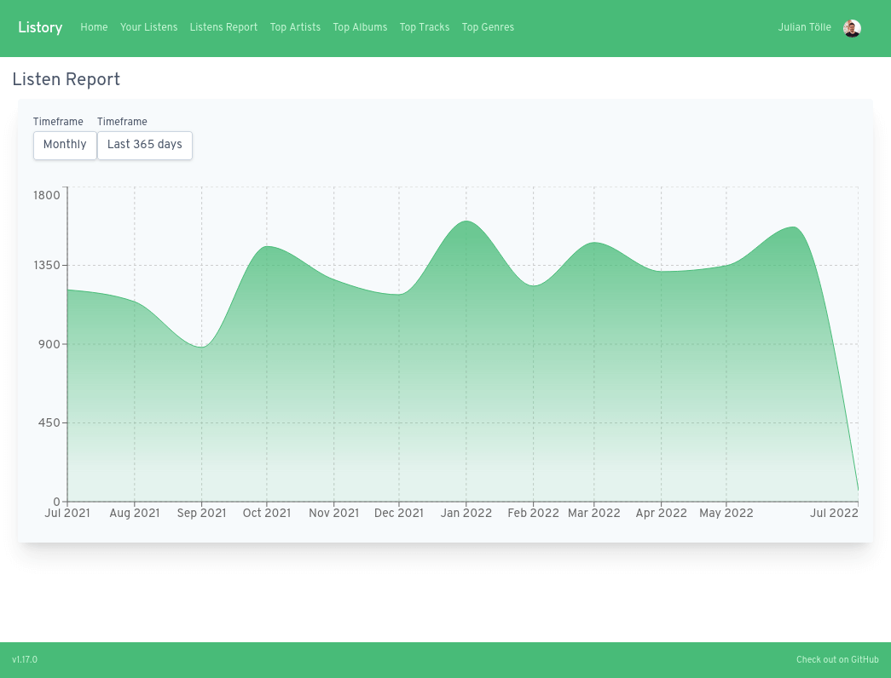
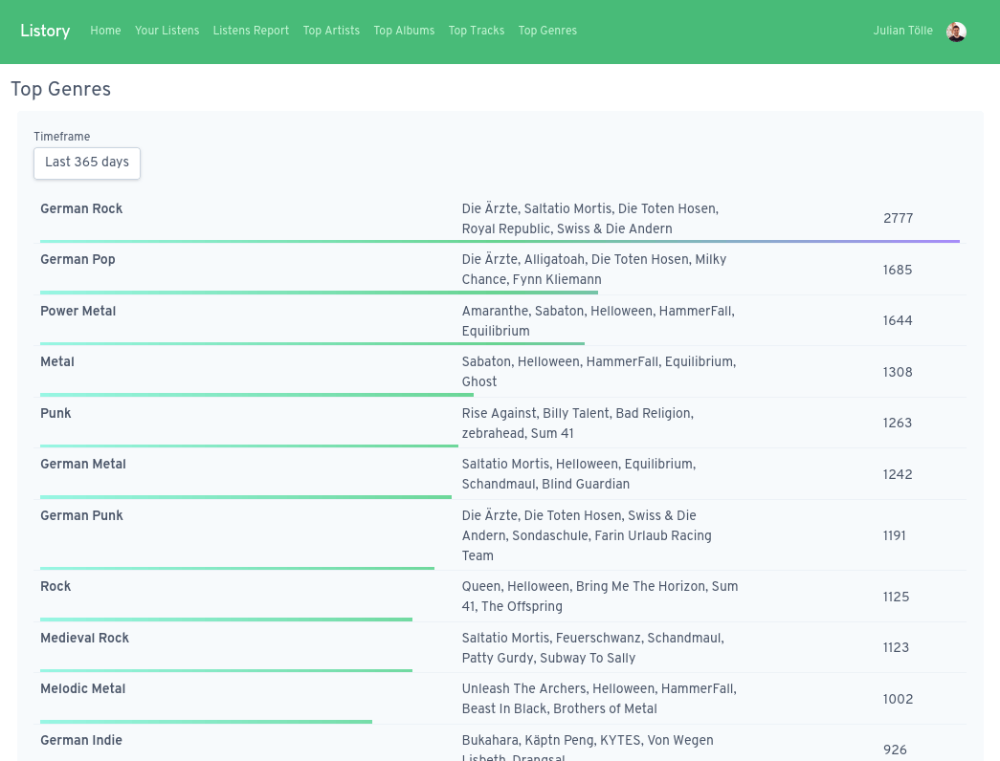

<p>
  <h1 align="center">
      Listory
    
  </h1>
</p>
  
<p align="center">
  <h4 align="center">Login with Spotify and Listory will save all tracks you listen to.</h4>
</p>

<p align="center">
  
  
  
  
</p>

<table align="center">
  <tr>
      <td colspan="2" align="center">
      
      <em>The listens report shows how many songs you have listened to during the last month (and all months prior to that).</em>
    </td>
  </tr>
  <tr>
    <td align="center" width="50%">
      
      <em>Want to know which song you heard on your drive to work last tuesday? Now you can!</em>
    </td>
    <td align="center" width="50%">
      
      <em>Find out what genres (or artists, albums, songs) you listen to the most!</em>
    </td>
  </tr>
</table>

## Installation

### Creating the Spotify App

To connect to the Spotify API, you need to create a new App on the [Spotify
Developer Dashboard](https://developer.spotify.com/dashboard/applications).

Once the App is created, open the App Overview and click on the "Edit Settings"
button. A new modal should open. In this modal, you need to add a Redirect URI,
so that the login with Spotify actually works. This URL depends on where you
want to host your Listory installation, see also `APP_URL` under
[Configuration / Application](#application). The Redirect URI should be
`$APP_URL/api/v1/auth/spotify/callback`. For the local example URL which is used
in development, this would be `http://localhost:3000/api/v1/auth/spotify/callback`.
If you have your own domain where you want to host Listory, this is probably
something like `https://listory.your-name.com/api/v1/auth/spotify/callback`.

You can add multiple Redirect URIs and all will work.

Keep the tab open, as you will need the _Client ID_ and _Client Secret_ in the
next step.

### Deployment

Listory currently supports two deployment mechanisms: _docker compose_ and
_Kubernetes Helm Chart_.

#### docker compose

There are two `docker compose` files in the repository, for a production
deployment, you want to use [`docker-compose.prod.yml`](./docker-compose.prod.yml).

You can copy this file to your server or whereever you want to run Listory. You
will also need to copy the `.env.sample` file next to the
`docker-compose.prod.yml` file and rename it to `.env`.

Open the `.env` file in an editor and put in the Spotify App _Client ID_ and
_Client Secret_.

Now you can configure Listory how you like by changing the `environment` of the
`listory` service in the docker compose file, or by adding new values in the
`.env` file. For a list of all available options, see section
[Configuration](#configuration).

If you deploy Listory on the public internet, I recommend you to add a
reverse proxy like [Traefik][traefik], which you can configure to
[automatically add TLS certificates][traefik-tls] (putting the S into HTTPS).

[traefik]: https://doc.traefik.io/traefik/getting-started/quick-start/
[traefik-tls]: https://doc.traefik.io/traefik/user-guides/docker-compose/acme-tls/

Once you have set everything up, you can run this command to start Listory:

```
docker compose up --daemon --file docker-compose.prod.yml
```

This will start Listory in the background. Checkout the [docker compose documentation][docker-compose],
to learn how you can work with the containers, for example to restart them or to
read the logs.

[docker-compose]: https://docs.docker.com/compose/reference/

### Helm Chart

We publish a Kubernetes Helm Chart that installs Listory into a Kubernetes cluster.

I have not yet setup publishing to an actual Chart Registry, so if you would like
to use the chart, create an issue and I will set this up properly.

You can find the source code for the Helm Chart under `[charts/listory](./charts/listory/)`.

### Configuration

All configuration must be set as environment variables. Default values are added in **bold**, values that are required are marked with _Required_.

#### Application

- `PORT`: **3000**: Port the webserver will listen on.
- `APP_URL`: **http://localhost:3000**: Public URL of the Application, is used to generate Links.

#### Authentication

- `JWT_SECRET`: _Required_, used to sign the JWTs.
- `JWT_ALGORITHM`: **HS256**: Algorithm used to sign the JWTs. One of `HS256`, `HS384`, `HS512`
- `JWT_EXPIRATION_TIME`: **1d**: Lifetime of signed JWTs. Accepts strings like `1d`, `2h`, `15m`.

#### Spotify

- `SPOTIFY_CLIENT_ID`: _Required_, Spotify App Client ID
- `SPOTIFY_CLIENT_SECRET`: _Required_, Spotify App Client Secret
- `SPOTIFY_FETCH_INTERVAL_SEC`: **60**: Interval for fetching recently listened tracks from Spotify.
- `SPOTIFY_UPDATE_INTERVAL_SEC`: **60**: Interval for updating previously imported music library entities (artist, album, track). Raise this number if you often hit the Spotify API Ratelimit.
- `SPOTIFY_WEB_API_URL`: **https://api.spotify.com/**: Spotify WEB API Endpoint.
- `SPOTIFY_AUTH_API_URL`: **https://accounts.spotify.com/**: Spotify Authentication API Endpoint.
- `SPOTIFY_USER_FILTER`: **""**: If set, only allow Spotify users with these ids to access the app. If empty, allow all users to access the app. Seperate ids with `,` eg.: `231421323123,other_id`.

#### Database

- `DB_HOST`: _Required_, Database host
- `DB_USERNAME`: _Required_, Database username
- `DB_PASSWORD`: _Required_, Database password
- `DB_DATABASE`: _Required_, Database database
- `DB_POOL_MAX`: **50**, max concurrent database connections

#### Sentry

You can use Sentry to automatically detect and report any exceptions thrown.

- `SENTRY_ENABLED`: **false**, Set to `true` to enable Sentry.
- `SENTRY_DSN`: _Required_, but only if `SENTRY_ENABLED` is `true`. The [DSN](https://docs.sentry.io/product/sentry-basics/dsn-explainer/) for your Sentry project.

#### OpenTelemetry

We use OpenTelemetry to provide observability into Listory API.

The metrics will be exposed on a seperate port at `:9464/metrics`. Make sure that this endpoint is not publicly available in your deployment.

Traces will be sent to the specified endpoint.

To use observability tools locally, check out `docker-compose` setup in `observability/`.

- `OTEL_METRICS_ENABLED`: **false**, Set to `true` to activate metrics.
- `OTEL_TRACES_ENABLED`: **false**, Set to `true` to activate traces.
- `OTEL_EXPORTER_OTLP_ENDPOINT`: _Required_, but only if `OTEL_TRACES_ENABLED` is `true`. The endpoint that traces are sent to, see [OpenTelemetry docs](https://github.com/open-telemetry/opentelemetry-js/tree/main/experimental/packages/exporter-trace-otlp-http#configuration-options-as-environment-variables)
- `OTEL_EXPORTER_PROMETHEUS_PORT`: **9464**, Set to configure non-standard port for Prometheus metrics

## Development

### Configure Spotify API Access

Copy the file `.env.sample` to `.env` and add your Spotify API Key.

### Starting the application

We use `docker compose` to provide a full local development environment.

```bash
$ docker compose up
```

You can now access the frontend at `http://localhost:3000` and the API at `http://localhost:3000/api`.

Frontend and API will automatically reload on any code changes.

### REPL Console

You can start the REPL console by starting the normal environment, and then running:

```bash
$ docker compose run console
```

### Observability

If you want to start the observability suite (Metrics & Tracing) locally, you can use the `observability` docker compose profile:

```bash
$ docker compose --profile observability up
```

Grafana is then available at `http://localhost:2345` and all sources are preconfigured.

## Test

```bash
# unit tests
$ npm run test

# e2e tests
$ npm run test:e2e

# test coverage
$ npm run test:cov
```

## License

Listory is [MIT licensed](LICENSE).
